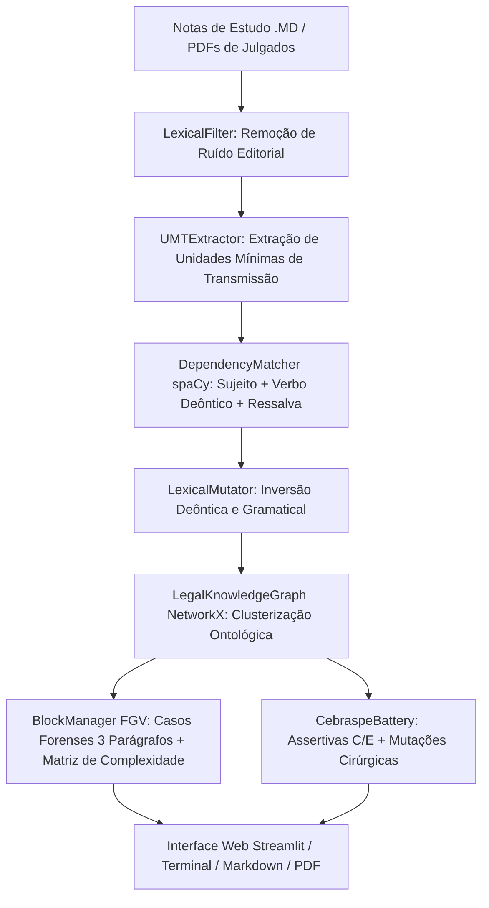

# ⚖️ LEXQUEST v2.0
### Sistema Especialista de Engenharia Ontológica e Geração Simbólica de Questões Jurídicas
*(Padrão FGV/ENAM e Cebraspe — 100% Determinístico, Auditável e Sem IA Generativa)*

[](https://www.python.org/)
[](https://spacy.io/)
[](https://streamlit.io/)
[](https://pytest.org/)
[](LICENSE)

---

## 🎯 Por que o LexQuest foi criado sem IA Generativa?

Em concursos de alto rendimento para carreiras jurídicas (como a **Magistratura**, **Ministério Público**, **Defensoria** e o **ENAM**), os Modelos de Linguagem Generativos (LLMs) tradicionais apresentam riscos estruturais severos:
* **Alucinações Normativas:** Criação de teses jurídicas e artigos de lei fictícios.
* **Inversões Imprecisas:** Distorção de modais deônticos essenciais (*prescindível* vs *imprescindível*) sem amparo legal.
* **Inconsistência de Gabarito:** Respostas que mudam a cada execução.

O **LexQuest v2.0** adota os fundamentos da **Ciência da Computação Simbólica**, **Engenharia Ontológica** e **Análise Sintática Computacional**:
1. **Zero Alucinação:** Cada questão e alternativa é gerada por regras matemáticas e gramaticais sobre a Lei Seca ou precedentes vinculantes.
2. **Auditabilidade Total:** Todo distrator possui rastreabilidade exata até o fundamento normativo violado.
3. **Reproducibilidade:** O mesmo conjunto de notas de estudo sempre produz questões canônicas e consistentes.

---

## 🏗️ Arquitetura do Pipeline



---

## 🚀 Como Executar

### 1. Clonar o Repositório
```bash
git clone https://github.com/junior-aguiar-eng/LEXQUEST.git
cd LEXQUEST
```

### 2. Criar e Ativar Ambiente Virtual
```bash
python -m venv .venv

# Windows:
.venv\Scripts\activate

# Linux / macOS:
source .venv/bin/activate
```

### 3. Instalar Dependências
```bash
pip install -r requirements.txt
python -m spacy download pt_core_news_sm
```

### 4. Executar

* **Opção 1: Web App no Navegador (Streamlit)**
  ```bash
  streamlit run app.py
  # Ou dê 2 cliques em iniciar_web.bat (Windows)
  ```

* **Opção 2: Painel Interativo no Terminal**
  ```bash
  python -m lexquest.menu
  # Ou dê 2 cliques em lexquest.bat (Windows)
  ```

* **Opção 3: Linha de Comando Direta (CLI)**
  ```bash
  # Resolver simulado FGV no terminal:
  python -m lexquest.cli resolver --material exemplos/adpf_973_exemplo.md --banca fgv

  # Gerar caderno de 10 questões Cebraspe:
  python -m lexquest.cli gerar --material exemplos/lei_11281_exemplo.md --banca cebraspe --qtd 10 --out simulado.md

  # Importar PDF de lei ou julgado para Markdown:
  python -m lexquest.cli importar-pdf --arquivo informativo_stf.pdf --out material.md
  ```

---

## 🧪 Testes Automatizados

O sistema conta com suíte completa de testes no `pytest`:
```bash
pytest -v
```
*(16 testes cobrindo mutações deônticas, grafos de conhecimento, matriz de complexidade FGV e balanceamento de bancas)*.

---

## 📄 Documentação Completa
* Consulte o [Manual Didático em Markdown](MANUAL_DIDATICO_LEXQUEST.md).
* Ou abra o documento diagramado oficial [Manual_Didatico_LexQuest.pdf](Manual_Didatico_LexQuest.pdf).

---

## ⚖️ Licença
Distribuído sob a licença MIT. Consulte `LICENSE` para mais detalhes.
